# SEA600 Machine Learning Assignment 1

## Problem & Data Description

### Objective

The objective of this machine learning project is to build a price prediction model for NYC FHV (For-Hire Vehicle). 

### Introduction

The goal of this project is to build a price model that predicts ride fares for FHV in New York City. A regression model or a neural net model that can provide an expected output based on feature inputs will fit into this problem. The dataset used in this project can be found on the New York City government [website](https://www.nyc.gov/site/tlc/about/tlc-trip-record-data.page). The size of the entire dataset is large, and we will use the latest subset (from November, 2022) for this project. Even though it's a subset, it still contains more than 18 million rows of data with 24 features. Thus, we will choose samples randomly from this dataset for training and testing. Due to the number of rows, models such as high degree (>3) regression, and non-linear SVR will not be explored as these models have high time complexity. Regarding societal, economic, health and safety, and regulatory factors that might affect the design, there's no edvidence that shows these factors would affect the design decision.

### Preliminary Data Exploration and Preparation

This dataset contains 24 features (See ***[Appendix I: Feature Data Dictionary](#appendix-i-feature-data-dictionary)***) and not all of them are useful, such as *Hvfhs_license_num*, *Dispatching_base_num* and *originating_base_num*, they only contain the information about the vehicle, which is irrelevant to the objective of this project.

#### Feature Selection

Based on the correlation heatmap, we decided to drop these features: *shared_request_flag, shared_match_flag, access_a_ride_flag, wav_request_flag, wav_match_flag*.

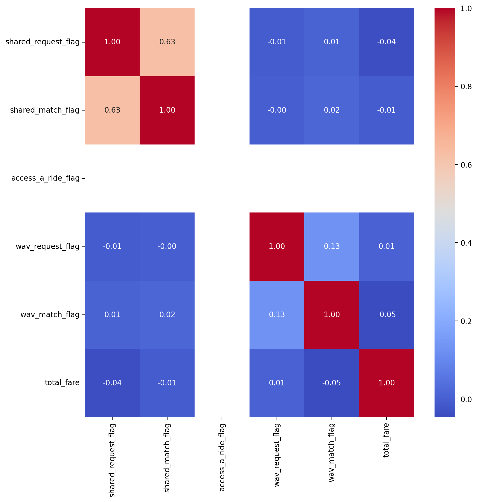


In addition, features such as *driver_pay, tips, tolls, bcf, sales_tax, request_datetim, on_scene_datetime* are not useful nor relevant to the project objective. *Tolls* usually depend on the route chosen and *bcf* (black car fee) is random, thus, we excluded these fees in our model.


After cleaning up the columns, the new dataset will look like this:

| index     | pickup_datetime       | dropoff_datetime      | PULocationID | DOLocationID | trip_miles | trip_time | base_passenger_fare | congestion_surcharge | airport_fee |
|-----------|-----------------------|-----------------------|--------------|--------------|------------|-----------|---------------------|----------------------|-------------|
| 12201792  | 2022-11-20 11:02:45   | 2022-11-20 11:19:49   | 41           | 48           | 5.28       | 1024      | 25.21               | 2.75                 | 0.0         |
| 5140632   | 2022-11-09 18:19:42   | 2022-11-09 18:26:37   | 157          | 82           | 1.39       | 415       | 10.64               | 0.00                 | 0.0         |
| 13040156  | 2022-11-21 19:13:41   | 2022-11-21 19:33:56   | 163          | 125          | 4.79       | 1215      | 42.57               | 2.75                 | 0.0         |
| 2107754   | 2022-11-04 17:47:21   | 2022-11-04 18:03:00   | 10           | 130          | 2.21       | 939       | 14.28               | 0.00                 | 0.0         |
| 17227919  | 2022-11-29 15:29:02   | 2022-11-29 15:33:30   | 210          | 210          | 0.63       | 268       | 7.51                | 0.00                 | 0.0         |

#### Data Visualization

(See ***[Appendix II: Data Visualization](#appendix-ii-data-visualization)***) 

After data visualization, we can clearly see a linear relationship between trip miles and base fare, trip time and base fare.

Regarding the airport fee and congestion surcharge, we see that most trips have 0 fee for both and nearly 40% of the trips were charged with a congestion fee of 2.75.

#### Statistic

| Statistic | pickup_datetime                | dropoff_datetime               | PULocationID | DOLocationID | trip_miles | trip_time | base_passenger_fare | congestion_surcharge | airport_fee |
|-----------|--------------------------------|--------------------------------|--------------|--------------|------------|-----------|---------------------|----------------------|-------------|
| count     | 100000                         | 100000                         | 100000.00000 | 100000.00000 | 100000.000 | 100000.00 | 100000.00000        | 100000.00000         | 100000.0000 |
| mean      | 2022-11-15 19:57:13.143010     | 2022-11-15 20:17:03.214390     | 139.92574    | 143.09041    | 5.04131    | 1191.8698 | 23.806279           | 1.140580             | 0.215383   |
| min       | 2022-11-01 00:00:43            | 2022-11-01 00:09:03            | 3.00000      | 1.00000      | **0.00000**    | **1.00000**   | **-33.250000**          | 0.000000             | 0.000000   |
| 25%       | 2022-11-08 15:01:34.750000     | 2022-11-08 15:21:22.250000     | 76.00000     | 76.00000     | 1.59000    | 609.00000 | 11.430000           | 0.000000             | 0.000000   |
| 50%       | 2022-11-15 19:52:28.500000     | 2022-11-15 20:10:41            | 141.00000    | 142.00000    | 3.00350    | 972.00000 | 18.030000           | 0.000000             | 0.000000   |
| 75%       | 2022-11-22 19:08:38            | 2022-11-22 19:32:05.750000     | 211.00000    | 219.00000    | 6.25500    | 1524.0000 | 29.240000           | 2.750000             | 0.000000   |
| max       | 2022-11-30 23:59:30            | 2022-12-01 00:38:28            | 265.00000    | 265.00000    | 186.54000  | 14994.000 | **551.620000**          | 5.500000             | 5.000000   |
| std       | NaN                            | NaN                            | 74.690144    | 77.634162    | 5.86778    | 850.07404 | 19.883770           | 1.351592             | 0.703936   |


Given the statistic above, we see that data cleaning is required: there's negative *base_passenger_fare*,  zero *trip_miles* and one-second *trip_time*.

In this case, we will only keep rows with *base_passenger_fare* greater than 5 dollars, *trip_miles* greater than 1 and *trip_time* greater than 5 mins and less than 2 hours.


### Feature Engineering

#### Fare, Airport Trip and Congestion

Since the dataset only contains a base fare column called *base_passenger_fare*, we will construct a new column called ***total_fare*** which is the sum of the base fare, congestion surcharge and airport fee.

Although the *airport_fee* and *congestion_surcharge* are numerical, given the data visualization result earlier, these features shall be treated as categorical features. Therefore, we will construct new features to represent these original features to reduce the cardinality.

For *airport_fee*, we will construct a new feature called ***is_airport_trip*** which will contain 1s and 0s indicating whether there's an *airport_fee*.

For *congestion_surcharge*, we will construct a new feature called ***congestion_lvl*** based on the congestion surcharge: 

| surcharge | congestion level| description|
|-----------|-----------------|------------|
|0|0| no congestion|
|less than 2 | 1 | low congestion |
|less than 3 | 2 | medium congestion |
| greater or equal than 3 | 3| high congestion|

#### Trip Time

The statistic shows that the *trip_time* column needs attention. Instead of using the original feature, we will construct a new feature *trip_time_real* deriving from the *dropoff_datatime* and *pickup_datetime*.

#### DateTime

More information can be extracted from the *dropoff_datetime* and *pickup_datetime* features such as year, month, day of week, hour etc.

Given the data is collected in the same month, in this case, we will only consider the day of the week and hour, thus, two features we can generate are ***pickup_day_no*** which contains values from 0 to 6 mapping Monday to Sunday and ***pickup_hour*** containing hour value from 0 to 23.

#### Location

*PULocationID* and *DOLocationID* are categorical features, which contain 262 possible values each. Using one-hot encoding is not feasible. We will discuss more about these features later in this report.

#### Encoding

The ***pickup_hour*** feature has 24 possible values and ***pickup_day_no*** has 7. Using One-Hot Encoding will increase the dimension by 31. Other encoding methods are not really applicable to these features. Thus, we have decided to divide these features into segments.

For ***pickup_day_no***, we simply reduce the categories to weekday and weekend.

For ***pickup_hour***, we map the hours to segments H1 to H6 using the graph as a reference:

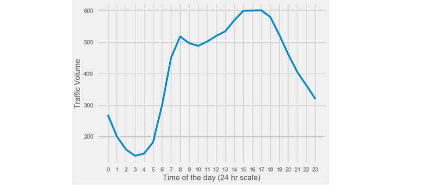

H1 will map hours with traffic volume under 200, H2 is between 200 to 300, ... , H6 is greater than 600.


#### Other Considerations and Exploration Done

##### Consideration 1: Target Encoding for *PULocationID* and *DOLocationID* 

We considered encoding *PULocationID* and *DOLocationID*  because we thought these might be useful features. However, One-Hot Encoding will increase the dimension of features by more than 500. Therefore, we considered Target Encoding, which makes the most sense and is more relevant among other encoding methods. 

##### Thoughts: 

The fare amount will depend on the *DOLocationID*, if we do feature-cross before encoding, the new feature might not be very helpful since it will just be the average fare between two locations.

##### Consideration 2: Feature Crossing *pickup_day_no* and *pickup_hour*

The fare amount at 5:00 a.m. Monday will be very different from the fare amount at 5:00 p.m. Friday. Each hour on a different day can be considered as a 'category' itself. If we do feature cross, by simply appending the values, for instance, Monday at 5 a.m. would be '05' and Friday at 5 p.m. would be 617, we will have 168 categories. With a high-cardinal feature, we may apply Target Encoding.

##### Thoughts:

Feature cross is possible but target encoding can be problematic since the total fare largely depends on the distance travelled. If we use *total fare* as the target, it will create inaccurate encoding. If we create a new feature called *fare_per_mile*, it will be more accurate. 

##### Challenge

One main challenge that target encoding poses is that we cannot use cross-validation on the training set since the features are engineered using the training target value. And the complexity of constructing an actual pipeline is high. Thus, we will create a dedicated validation set in the custom pipeline.

In the pipeline, we take extra samples from the dataset, then we use Train-Test Split to split the data into training and test sets, and then we split the test set again into validation set and test set.

##### Other explorations:

We tried crossing *day*, *time* and *locations*, making a *wait_time* feature using *pickuptime - onscene_time* , making time related features such as *is_morning*, *is_afternoon* and no evidence shows that they have considerable impact on the model. 

#### PCA

PCA in this case was not helpful. We could use PCA to reduce the dimension of the data but we get increased error. Based on the result, only a couple of features can be reduced without really affecting the accuracy. Therefore, we decided not to use PCA.

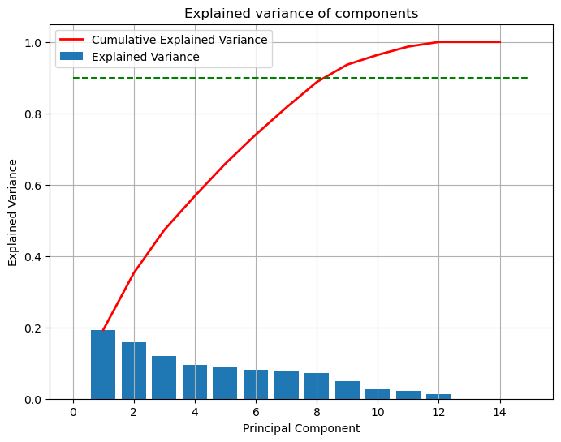

### Processed Dataset 

After cleaning up the dataset and feature crossing and encoding, this is how the dataset looks like.

| trip_miles | is_airport_trip | congestion_lvl | trip_time_real | hourly_segments_H1 | ... | hourly_segments_H6 | day_segments_WD | day_segments_WK | total_fare | enc_day_x_time | enc_PUxDOL |
|------------|-----------------|----------------|----------------|--------------------|-----|--------------------|-----------------|-----------------|------------|----------------|-------------|
| 1.660      | 0               | 2              | 12.667         | 0                  | ... | 0                  | 1               | 0               | 17.91       | 5.371463       | 22.811771   |
| 4.240      | 0               | 0              | 15.583         | 1                  | ... | 0                  | 0               | 1               | 16.91       | 5.977721       | 25.739411   |
| 2.690      | 0               | 0              | 11.050         | 0                  | ... | 0                  | 0               | 1               | 12.50       | 4.534792       | 24.736056   |
| 1.867      | 0               | 0              | 8.033          | 0                  | ... | 0                  | 1               | 0               | 11.53       | 5.753829       | 23.149589   |
| 4.380      | 0               | 0              | 15.067         | 0                  | ... | 0                  | 1               | 0               | 15.10       | 6.306063       | 24.531976   |


## Model Training (with 20000 samples)

From previous experiments and observations, we decided to train and evaluate these models:

- Linear Regressor: the data visualization shows a linear relationship
- Polynomial Regressor: other features such as the engineered features might have a non-linear relationship with the target
- Ridge Regressor: ridge regressor can filter out useless features
- KNN Regressor: given the data points are sparse, KNN might be more accurate

### Linear Regressor

Simple Linear Regressor will act as our baseline model. In the project, we did simple regression with datasets with and without the encoded features. In addition, we did validation and cross-validation.

| MSE | With E-features | Without E-features |
|---|----|----|
|Validation| 88.032151 | 89.146471 | 
|Cross Validation| 66.030708 | 70.319246|

The result indicates that the model with E-features performs slightly better.

***E-featuers***: *enc_day_x_time and enc_PUxDOL*

***Validation***: *using the validation set from the pipeline.*

***Cross Validation***: *using the training set from the pipeline, the E-features are engineered using target encoding, which might affect the result if we use the dataset with E-features*

### Polynomial Features - Linear Regressor

#### Which Degree?

Due to limited computational power, we were only able to try out degrees 2, 3 and 4 with cross-validation. Results indicated that degree 2 will best fit the dataset.


| degree | mean MSE with E-features| mean MSE without E-feature |
|---|---| ---|
|2  | 55.596956258167644| 69.7306410526892|
|3  | 68.49016039277582| 80.10497379604051|
|4  | 3645844246931548.0| 1008693765148216.1|


#### Degree 2 Poly Regressor MSE

| MSE | With E-features | Without E-features |
|---|----|----|
|Validation| 122.386827 | 79.897460 |
|Cross Validation| 62.504570 | 74.498702|


### Ridge Regressor

#### Parameters:

```python
ridge = Ridge(alpha=3, solver='sag', fit_intercept=True)
```

#### MSE Result:

| MSE | With E-features | Without E-features |
|---|----|----|
|Validation| 88.044958 | 89.148403 |
|Cross Validation| 66.046759 | 70.313172|

#### Poly Ridge:

With the Polynomial feature of degree 2, the Ridge Regressor performs the same as the Linear Regressor with the polynomial feature degree 2 based on the grid search result.

```python
Best parameters: {'alpha': 9, 'fit_intercept': True, 'solver': 'lsqr'}
Best score: -55.55625956334685
```

### KNN Regressor

#### Parameters:

```python
knn = KNeighborsRegressor(n_neighbors=5)
```

#### MSE Result:

| MSE | With E-features | Without E-features |
|---|----|----|
|Validation| 95.597957 | 105.013722 |
|Cross Validation| 67.921930 | 83.407372|

## Resource Utilization (With E-features)

### Time: (ms)

|           | Linear | Poly_Linear_2|  Ridge | KNN |
|-------    | ------ | -------------|  ------|-----|
|Overall    | 27.1   |   207        | 40.3   | 153 |
|Fitting    |   5.98     |  73.6    |  24.2  | 5.28 |
|Predicting |  3.72   |    0.842      | 1.52   |95.9 |

### Memory: (peak memory in MiB, Increment in Mib)

|           | Linear | Poly_Linear_2| Ridge | KNN |
|-------    | ------ | -------------|  ------|-----|
|Overall    |   259.47, 4.66     | 296.00, 36.5      |  281.42, 1.93     |   283.22, 1.80  |
|Fitting    |  253.58, 0.00      |     284.34, 33.92         |      288.03, 3.69        |  290.20, 2.17   |
|Predicting |   235.84, -7.23      |   240.25,  0.41          |    242.75, 0.03            |  243.50, 0.50 MiB     |

## Final Model

To choose the final model, we will consider the model with the lowest value when:

- Single validation is used when there are E-features
- Cross-validation is used when there are no E-features

In addition, the resource usage of this model is acceptable.

These parameters are used based on the grid search result:

```python
Best parameters: {'alpha': 3, 'fit_intercept': True, 'solver': 'sag'}
Best score: -66.02571857571097
```

We trained 2 models with and without the E-features and in this case, the results are pretty similar:

| | With E-features | Without E-features|
|---|---|---
|MAE|4.6459 |4.6256 |

Compared to the range of 25 to 75 percentile, the **MAE% is 25.09%**.

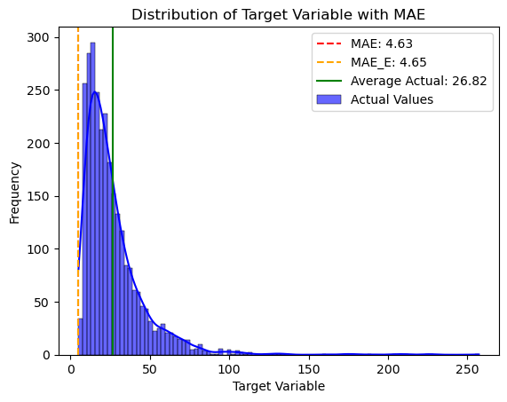

Below is the scatter plot of Actual vs Predicted Value.

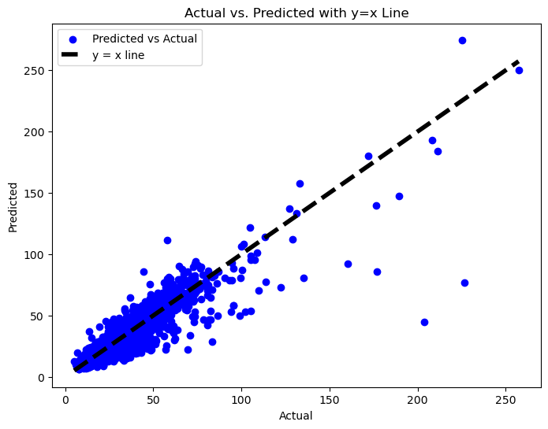

Below is the feature importance:

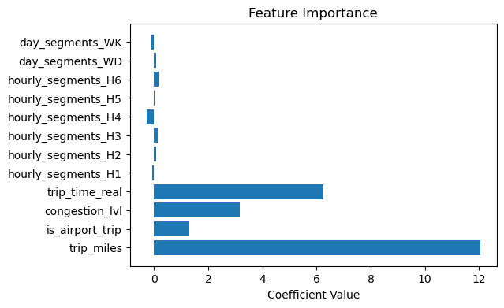

We use the traffic volume chart as a reference to divide the hour segments. H6 is the rush hour, 3 - 5 p.m. and the model was able to capture this information. In addition, the fare is higher if it's a weekday and lower at weekends. However, the date and time information does not contribute largely  to the fare. The fare mainly depends on the trip miles and trip time.


## Summary & Reflection

This project was a simple linear regression project, however, it's not simple to come up with an accurate model. The challenges we faced was the resources. The dataset contains 18 million rows, the amount of data was simply too much for data exploration and experiment purposes. Therefore, we only sampled a subset of it for experiment and model training. In addition, the results changes as the number of sample changes as well.

The majority of the effort was spent on feature engineering as we were trying to make use of the pickup and drop-off locations, and the day and time. However, these features have high cardinality, and PCA was not a good solution, we had to find other ways to keep the useful information provided by these features yet keep the dimension as low as possible. Target encoding was a good way to encode features with high cardinality but it poses challenges mentioned earlier in this report. The final result also shows that feature crossing and encoding did not significantly improve the regression model. However, it might be useful for a neural network model if we add an embedding layer after feature crossing to address the high cardinality. In addition, a pipeline is needed for this project since it involves feature selection and engineering. To reduce the complexity of the experiment, a custom pipeline was built for data processing. For details, please see  ***[Appendix III: Custom Pipeline](##appendix-iii-custom-pipeline)***

We also spent some time exploring different models such as LinearSVR, Stacking Regressor, ElasticNet, Lasso etc. These models came up with similar results and some of them took additional resources. Thus, they were not used in the final code and report.

**Conclusion**: based on the experiments, using feature engineering and differnt models result in similar error: around 4.5. We consider the model acceptable given the data itself is sparse, i.e. the prices of the same trip can vary. To make this model more accurate, we could consider other factors such as weather, and include more data samples and data from other month and year. Other model such as neural network might be used instead to improve the accuracy.


# Appendix I: Feature Data Dictionary

| Field Name            | Description                                                                                                                   |
|-----------------------|-------------------------------------------------------------------------------------------------------------------------------|
| Hvfhs_license_num     | The TLC license number of the HVFHS base or business. HVFHS licensees include Juno (HV0002), Uber (HV0003), Via (HV0004), Lyft (HV0005). |
| Dispatching_base_num  | The TLC Base License Number of the base that dispatched the trip                                                             |
| Pickup_datetime       | The date and time of the trip pick-up                                                                                         |
| DropOff_datetime      | The date and time of the trip drop-off                                                                                        |
| PULocationID          | TLC Taxi Zone in which the trip began                                                                                         |
| DOLocationID          | TLC Taxi Zone in which the trip ended                                                                                         |
| originating_base_num  | Base number of the base that received the original trip request                                                               |
| request_datetime      | Date/time when passenger requested to be picked up                                                                            |
| on_scene_datetime     | Date/time when driver arrived at the pick-up location (Accessible Vehicles-only)                                              |
| trip_miles            | Total miles for passenger trip                                                                                                |
| trip_time             | Total time in seconds for passenger trip                                                                                      |
| base_passenger_fare   | Base passenger fare before tolls, tips, taxes, and fees                                                                       |
| tolls                 | Total amount of all tolls paid in trip                                                                                        |
| bcf                   | Total amount collected in trip for Black Car Fund                                                                             |
| sales_tax             | Total amount collected in trip for NYS sales tax                                                                              |
| congestion_surcharge  | Total amount collected in trip for NYS congestion surcharge                                                                   |
| airport_fee           | $2.50 for both drop off and pick up at LaGuardia, Newark, and John F. Kennedy airports                                        |
| tips                  | Total amount of tips received from passenger                                                                                  |
| driver_pay            | Total driver pay (not including tolls or tips and net of commission, surcharges, or taxes)                                    |
| shared_request_flag   | Did the passenger agree to a shared/pooled ride, regardless of whether they were matched? (Y/N)                               |
| shared_match_flag     | Did the passenger share the vehicle with another passenger who booked separately at any point during the trip? (Y/N)          |
| access_a_ride_flag    | Was the trip administered on behalf of the Metropolitan Transportation Authority (MTA)? (Y/N)                                 |
| wav_request_flag      | Did the passenger request a wheelchair-accessible vehicle (WAV)? (Y/N)                                                        |
| wav_match_flag        | Did the trip occur in a wheelchair-accessible vehicle (WAV)? (Y/N)                                                            |

<br/>

# Appendix II: Data Visualization

## Base Fare Distribution

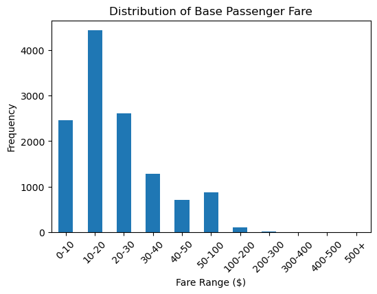

As shown in the graph, the majority of the data are in range of 0 to 30.

## Trip Miles vs Fare

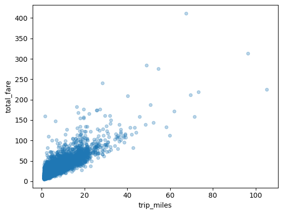

## Trip Time vs Fare

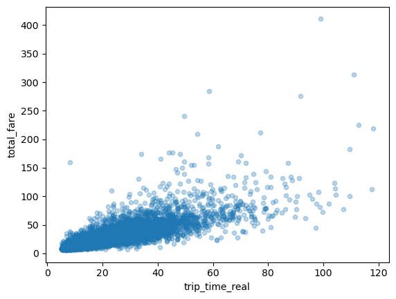

These graphs show linear relationship between miles, trip time and total.

## Airport Trip vs Fare

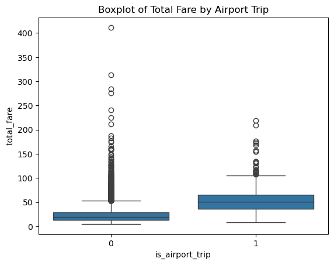

This graph indicates that the average fare of an airport trip is higher than non-airport trip.

## Congestion Level vs Fare

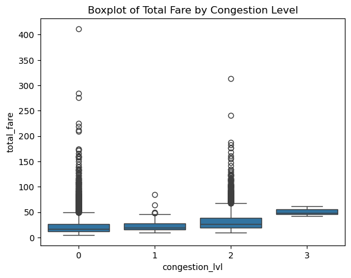

This graph indicates that the average fare goes higher as the congestion level goes higher.


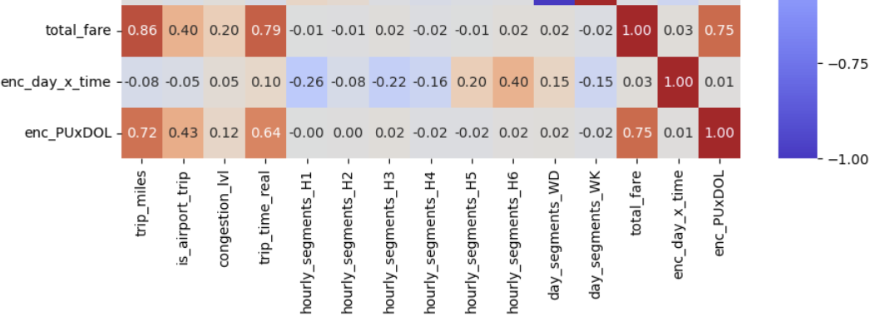

This heatmap indicates strong correlations between the target and trip miles, time, is airport trip, and congestion level.

The enc_PUxDOL variable here can be redundant. It’s the pickup location cross drop-off action and encoded using the target variable, information that this variable provides shall be captured by the trip miles already.

## Congestion and Airport Fee Counts

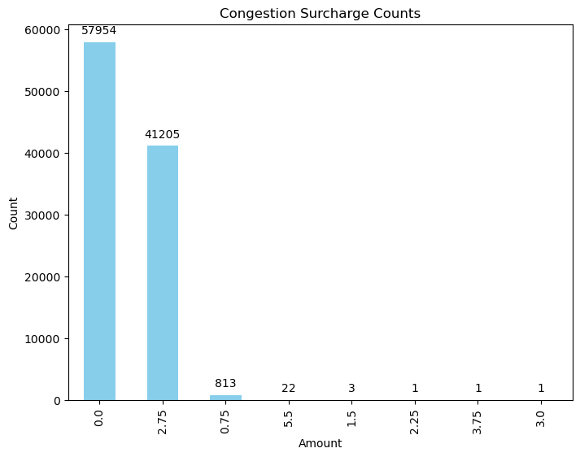

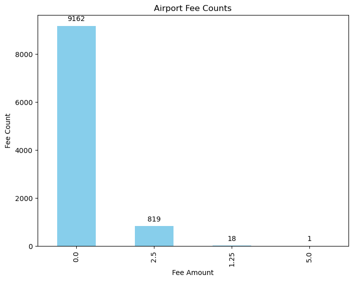

The above graphs show that there are only a few possible values for congestion surcharge and airport fees. Thus, these can be treated as categorical features.

# Appendix III: Custom Pipeline

The FHVProcessPipeline takes an FHV dataset file and returns a training set, validation set, test set and the original dataset without unuseful columns.

Following are the steps in the pipeline:

### Step 1. Dropping Columns: 

Irrelevant columns are dropped in this step:

```python
['hvfhs_license_num', 'dispatching_base_num', 'originating_base_num', 'shared_request_flag', 'shared_match_flag', 'access_a_ride_flag', 'wav_request_flag', 'wav_match_flag', 'bcf', 'tolls', 'sales_tax', 'tips', 'request_datetime', 'on_scene_datetime', 'driver_pay']
```

In addition, the returned original dataset is the result of step 1.

### Step 2. Feature Engineering

In this step, new features are engineered:

- is_airport_trip: 1 if air_port fee is not zero and 0 otherwise.

- congestion_lvl: map the congestion surcharge to the congestion level from 0 to 3. (No congestion to high congestion)

- trip_time_real: dropoff_datetime - pickup_datetime

- total_fare: sum of base_passenger_fare, airport_fee and congestion_surcharge

- pickup_day_no: day of the week in numerical format, ranging from 0 - 6 (Mon - Sun)

- pickup_hour: hour of the day, ranging from 0 to 23

- hourly_segments: maps the hour of day into different segments using hourly traffic volume as a reference

- day_segments: maps the day of the week to weekday or weekend


### Step 3. Dropping Outliers

In this step, outliers are dropped:

- base_passenger_fare less than 5
- real trip time of less than 5 minutes or greater than 2 hours
- trip_miles less than 1

### Step 4. Feature Crossing

In this step, features pickup_day_no and pickup_hour are crossed to generate a new categorical feature called day_x_time.

The same applies to PULocationID and DOLocationID, the new feature is called PUxDOL

### Step 5. Train Test Split

The data will be split into a training set and a test set since the next step involves encoding using the target variable.

### Step 6A. Encoding

The step encodes the features day_x_time and PUxDOL using a derived target feature fare_per_mile and the target variable total_fare.

The encoded variables are called enc_day_x_time and enc_PUxDOL

### Step 6B. Encoding Test Set

The encoders were fit using the training data and is used to transform the test set in this step.


### Step 7. Dropping Columns

The columns that will not be used for prediction will be dropped:

```python
['pickup_datetime', 'dropoff_datetime','PULocationID','DOLocationID', 'trip_time', 'base_passenger_fare', 'congestion_surcharge', 'airport_fee', 'pickup_day_no', 'pickup_hour']
```

### Step 8. Generate Validation Set

This step will take part of the data in the test set as a validation set.

